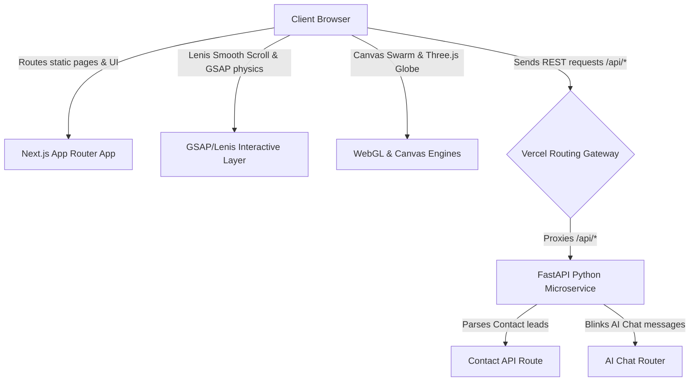

# Buildlyst Full-Stack Architecture & Design System

This document outlines the design system, frontend components, interactive physics engines, and API decoupling architecture for the modernized Buildlyst platform.

---

## 1. Architectural Blueprint

Buildlyst uses a **Decoupled Jamstack + Microservices API** architecture. The frontend layer is entirely static-compiled and dynamic-hydrated using Next.js (React + TypeScript), while the backend layer operates as a pure Python FastAPI REST JSON microservice.



### Decoupled Routing & Environments
1.  **Production (Vercel Single-Deployment)**:
    *   Vercel serves the compiled Next.js App directory statically.
    *   [`vercel.json`](file:///d:/End%20to%20End%20Projects/buildlyst/vercel.json) redirects all requests under `/api/*` to the Python serverless function router (`api/index.py`), which bootstraps the FastAPI backend dynamically.
2.  **Local Development (Proxy Setup)**:
    *   FastAPI runs on `http://127.0.0.1:8000`.
    *   Next.js runs on `http://localhost:3000`.
    *   [`next.config.ts`](file:///d:/End%20to%20End%20Projects/buildlyst/frontend/next.config.ts) sets up an rewrite proxy that automatically redirects requests to `/api/*` to the local FastAPI port, resolving Cross-Origin Resource Sharing (CORS) conflicts.

---

## 2. Global Design System (Tokens)

All layout structures, typography scales, and glow variables are declared in [globals.css](file:///d:/End%20to%20End%20Projects/buildlyst/frontend/src/app/globals.css) using CSS custom properties.

```css
:root {
    /* Premium High-Contrast Dark-Mode Colors */
    --c-bg: #030305;
    --c-surface: rgba(255, 255, 255, 0.03);
    --c-surface-hover: rgba(255, 255, 255, 0.08);
    --c-border: rgba(255, 255, 255, 0.1);

    /* Text Color Tokens */
    --c-text-primary: #FFFFFF;
    --c-text-secondary: #A0A0A5;

    /* High-Shine Neon Gradients */
    --c-accent-cyan: #00D2FF;
    --c-accent-blue: #3A7BD5;
    --c-accent-purple: #8A2387;

    /* Typographic Hierarchy (Google Fonts Import) */
    --font-display: 'Space Grotesk', sans-serif;
    --font-body: 'DM Sans', sans-serif;
    --font-mono: 'Fira Code', monospace;
}
```

---

## 3. High-Fidelity Physics & WebGL Engines

The interface features three distinct interactive client-side physics components:

### A. 3D Globe with UnrealBloom Shaders ([Globe3D.tsx](file:///d:/End%20to%20End%20Projects/buildlyst/frontend/src/components/Globe3D.tsx))
Built using Three.js and custom GLSL shader materials:
*   **Continent Mapping**: Generates geographical coordinates dynamically by sampling transparent pixels from a flat land/water Mercator projection map on a hidden HTML5 canvas.
*   **Shader Shimmering**: Vertices in the land particles are animated with a time-based cosine phase offset (`dotsMat.uniforms.time.value`), creating a micro-shimmer.
*   **Dual-Tone Bloom**: Leverages `UnrealBloomPass` at `1.0` strength to add a premium neon glow. Continent dots are styled in cyan (`0x00bfff`) while the atmospheric glow wraps the outline in deep violet (`0x8a2387`).

### B. HTML5 Canvas Boids Swarm Simulation ([SwarmFooter.tsx](file:///d:/End%20to%20End%20Projects/buildlyst/frontend/src/components/SwarmFooter.tsx))
Implements Craig Reynolds' Boids Algorithm for simulating emergent flocking behaviors:
*   **Flocking Rules**: Boids calculate steering vectors based on three core constraints:
    1.  *Separation*: Steer to avoid crowding local flockmates.
    2.  *Alignment*: Steer towards the average heading of local boids.
    3.  *Cohesion*: Steer to move toward the average center position of local boids.
*   **Cursor Magnetism**: Adds a fourth force pulling Boids towards the user's cursor position when active, creating an interactive visual grid.

### C. Magnetic Cursor & Smooth Scroll Physics ([ClientWrapper.tsx](file:///d:/End%20to%20End%20Projects/buildlyst/frontend/src/components/ClientWrapper.tsx))
*   **Lenis Scroll**: Replaces native browser scrolling with inertial, easing scroll calculations.
*   **Cursor Follower**: Tracks the cursor position inside `requestAnimationFrame` hooks to prevent mouse-movement latency. Event delegation toggles a `.hover` ring scale overlay on interactive controls.
*   **Hash Interceptor**: Intercepts standard route changes on `href` hash links (e.g. `#contact`), routing the event through `lenis.scrollTo()` to bypass browser snap movements and Next.js layout resets.

---

## 4. UI Modules & Interactive Sandboxes

### A. Modular Capabilities Sections
*   [Capabilities.tsx](file:///d:/End%20to%20End%20Projects/buildlyst/frontend/src/components/Capabilities.tsx): Interactive accordions that transition heights smoothly. Hovering over a capability card expands its detailed metrics while closing sibling cards.
*   [PhilosophyV2.tsx](file:///d:/End%20to%20End%20Projects/buildlyst/frontend/src/components/PhilosophyV2.tsx): Displays inputs passing through a central hub to business outcomes, using animated SVG pipelines styled with radial glow gradients.

### B. Engineering Methodology Scroll-Stacking ([Methodology.tsx](file:///d:/End%20to%20End%20Projects/buildlyst/frontend/src/components/Methodology.tsx))
Uses sequential `position: sticky` layers:
*   Card containers stick at staggered top positions (e.g., `100px`, `140px`, `180px`, `220px`).
*   To prevent transparent overlays from blending paragraphs, each card is styled with an opaque background (`background: #070913;`).
*   As the user scrolls, each card slides up and covers the content of the card before it, leaving only the header tabs and step numbers (`01`, `02`, `03`, `04`) visible at the top.

### C. Interactive Playground Sandbox ([Playground.tsx](file:///d:/End%20to%20End%20Projects/buildlyst/frontend/src/components/Playground.tsx))
Simulates a live AI model assembly workflow:
*   Users configure parameters (Model type, Temperature, Vector database index, Prompts) via glass sliders and dropdown selectors.
*   Triggers a simulated compilation terminal that outputs standard log files and compiler streams via a typewriter scheduler.
*   Concurrently generates a mock YAML pipeline script corresponding to the chosen sliders in real time.

---

## 5. Decoupled Backend REST APIs

The FastAPI microservice ([main.py](file:///d:/End%20to%20End%20Projects/buildlyst/backend/main.py)) handles pure JSON data exchanges:

1.  **Lead Capture (`POST /api/contact`)**:
    *   Receives structured JSON from the frontend chat-wizard lead generator ([ContactForm.tsx](file:///d:/End%20to%20End%20Projects/buildlyst/frontend/src/components/ContactForm.tsx)).
    *   Validates submission structures, saves entries, and returns a transaction success payload.
2.  **Conversational Chat Widget (`POST /api/chat`)**:
    *   Receives user messages from the interactive floating widget ([ChatbotWidget.tsx](file:///d:/End%20to%20End%20Projects/buildlyst/frontend/src/components/ChatbotWidget.tsx)).
    *   Communicates with backend python prompt engines and returns a stream or structured response simulating cognitive thoughts.
3.  **Application Health Checks (`GET /health`)**:
    *   Provides health telemetry endpoints for infrastructure checks.
